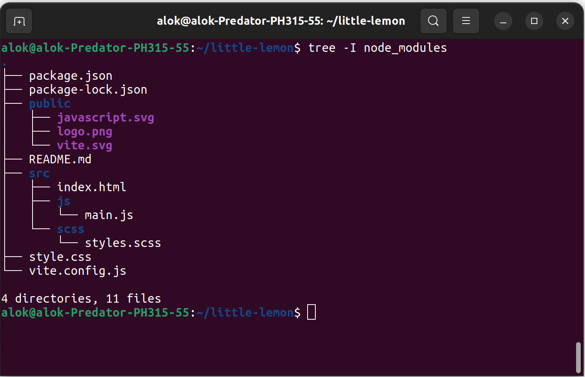

# Little Lemon

This is the first HTML and CSS project in the [Meta Introduction to Front-End Development Specialisation on Coursera](https://www.coursera.org/learn/introduction-to-front-end-development/programming/omNSR/creating-an-html-document).

Students are required to just examine this project to familiarize themselves with various HTML tags, but I decided to take to the next level by creating a project from scratch!

## Installation

This project was bootstrapped with [vite](https://vitejs.dev/guide/).

```bash
npm create vite@latest
```

## Usage

```bash

# get into the directory
cd my-project

# install dependancy
npm install

# run the dev server
npm run dev

```

## If you want to use bootstrap
```bash

# In the project directory
npm i --save bootstrap @popperjs/core

# Install additional dependency.
npm i --save-dev sass

```

## Create Bootstrap 5.2 Project structure (if you want to use bootstrap)
```bash

# Run below command to create src folder, scss and other file.

mkdir {src,src/js,src/scss}
touch src/index.html src/js/main.js src/scss/styles.scss vite.config.js

```

When you’re done, your complete project directory structure might look 
like 

## UI Screenshot

Without Bootstrap it might look like


## Contributing

Pull requests are welcome. For major changes, please open an issue first
to discuss what you would like to change.

Please make sure to update tests as appropriate.

## License

[MIT](https://choosealicense.com/licenses/mit/)

[def]: ./public/tree.png